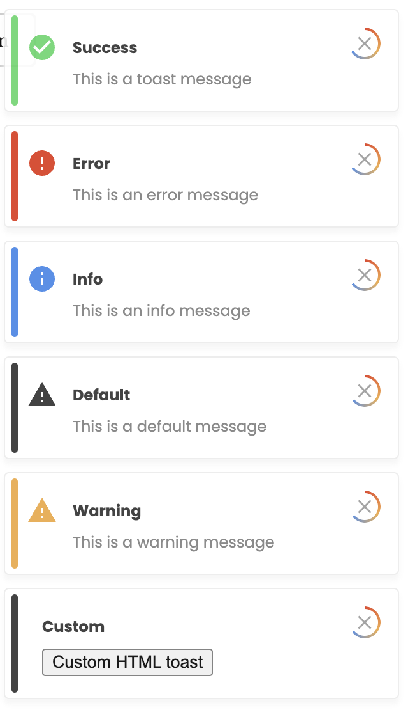
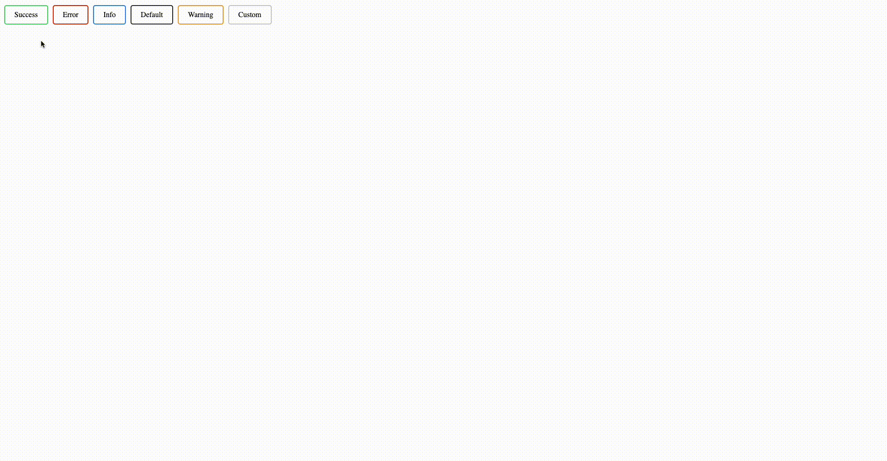

# t-react-toast
A simple react toast component

------------------------



### Usage:

1. Install in your React.JS application: ```npm install t-react-toast``` / ```yarn add t-react-toast```.
2. In App.tsx <br/>
   a. Import : ```import {ToastComponent} from 't-react-toast'```.<br/>
   b. Add it in your render method: ```<ToastComponent />```.
3. Import ToastService in your component: ```import {ToastService} from 't-react-toast'```.
4. Use ToastService to show alert in your component: ```ToastService.showToast({message: 'Hello World', type: 'success'})```.

------------------------------------------------------

### Demo
[Live Demo](https://6s79me.csb.app/)

### Available options

You can use bellow options to customise.
##### Coming soon



Thanks to [Vinod Y](https://www.behance.net/vinodkumar115) for providing the design mockups.
## License

MIT Licensed. Copyright (c) Manoj varma 2023.
